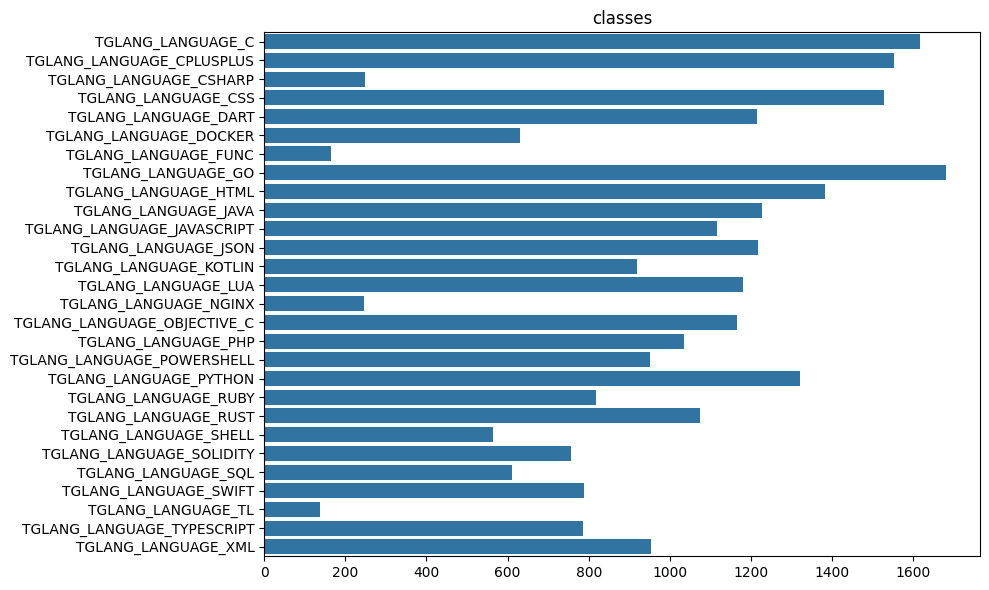
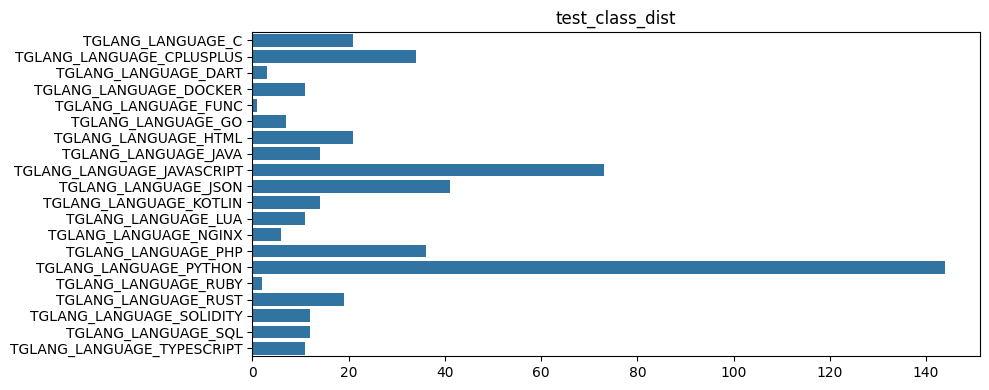
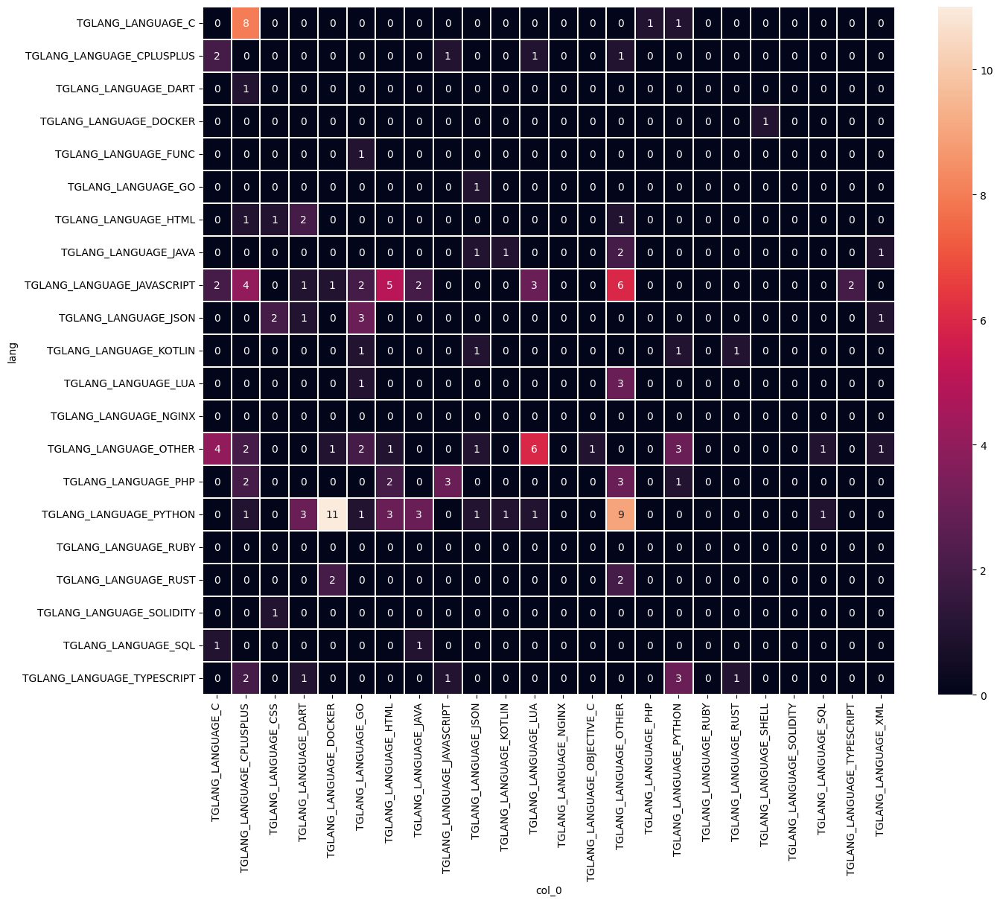

# Tglang - identify a programming language of a code snippet

This is a solution for [Telegram hackathon](https://contest.com/docs/ML-Competition-2023-r2).

The list of supported languages:
```markdown
  TGLANG_LANGUAGE_C
  TGLANG_LANGUAGE_CPLUSPLUS
  TGLANG_LANGUAGE_CSHARP
  TGLANG_LANGUAGE_CSS
  TGLANG_LANGUAGE_DART
  TGLANG_LANGUAGE_DOCKER
  TGLANG_LANGUAGE_FUNC
  TGLANG_LANGUAGE_GO
  TGLANG_LANGUAGE_HTML
  TGLANG_LANGUAGE_JAVA
  TGLANG_LANGUAGE_JAVASCRIPT
  TGLANG_LANGUAGE_JSON
  TGLANG_LANGUAGE_KOTLIN
  TGLANG_LANGUAGE_LUA
  TGLANG_LANGUAGE_NGINX
  TGLANG_LANGUAGE_OBJECTIVE_C
  TGLANG_LANGUAGE_PHP
  TGLANG_LANGUAGE_POWERSHELL
  TGLANG_LANGUAGE_PYTHON
  TGLANG_LANGUAGE_RUBY
  TGLANG_LANGUAGE_RUST
  TGLANG_LANGUAGE_SHELL
  TGLANG_LANGUAGE_SOLIDITY
  TGLANG_LANGUAGE_SQL
  TGLANG_LANGUAGE_SWIFT
  TGLANG_LANGUAGE_TL
  TGLANG_LANGUAGE_TYPESCRIPT
  TGLANG_LANGUAGE_XML
```

Other programming languages and non-code text are identified
as `TGLANG_LANGUAGE_OTHER` (index 0).

## Usage

### Build 

Unzip `submission.zip` file inside 
[libtglang-tester](https://data-static.usercontent.dev/libtglang-tester-r2.tar.gz)
folder and build it:
```shell
mkdir build
cd build
cmake -DCMAKE_BUILD_TYPE=Release ..
cmake --build .
```

### Run

Run on any text file:
```shell
$ ./tglang-tester <path/to/file.ext>
# prints: 1
```

## Model development

### Data

Check out [this notebook](notebooks/0.3.0-rg-tglang-data-prep.ipynb)
for stats and data prep steps.

- Training data consisted of 3.7k+ files with 220k+ lines of code.
It consisted of files from the [Stack dataset](https://huggingface.co/datasets/bigcode/the-stack/viewer/default/train)
and manually collected from GitHub.
- Test set was manually labelled from [Telegram r1 files](https://data-static.usercontent.dev/ml2023-r1-dataset.tar.gz)
It consisted of 493 files and 7404 lines of code. Not all classes are present in the test set.
- Train files were split into shorter sequences of lines to 
match the test files' length. 
- OTHER files from the telegram files were added to the train set
to make up 20% of the data and to the test set to make up 50% of the data.

**Train set class distribution:**


**Test set class distribution:**


### Model

Check out [this notebook](notebooks/0.3.1-rg-build-model-tglang.ipynb)
for model building and export.

1. Tokenizer - a simple text tokenizer is used to extract
keywords and special characters from the code. Numbers,
comments and docstrings are removed.
2. Text embedding - a TfIdf vectorizer is used to extract
features from the train set. TfIdf params are:
```python
    max_features=1000,
    binary=True, 
    ngram_range=(1,1), 
    tokenizer=tokenize_text,
    lowercase=False,
```
3. Classifier - a simple multinomial naive bayes is trained on 
vectorizer output.

### Results

- Accuracy on the test set: 0.82
- Accuracy on the validation set: 0.83

**Confusion matrix:**


### Export

The final model (tfidf+nb) is exported to 
[TorchScript](https://pytorch.org/docs/stable/jit.html) 
and to json with vocabulary and weights.

## C++ inference

### Option 1. ONMT + TorchScript

This option matches python predictions, however it's very slow (600ms/file).

1. Run `make build` to build the `libtglang.so` lib with _docker_.
2. Run `make test` to run a clean test of the library 
on a bunch of test files and evaluate the accuracy score.
3. Run `make submit` to create a final `submission.zip` file.

### Option 2. C++ shared library from json

This runs much faster (under 10ms/file) but the predictions are slightly different
from python.

#### Generate C++ Code

To generate the `vectorizer_gen.inc` and `data_gen.inc` files, 
you'll need to install [Deno](https://deno.com/).
Once installed, navigate to the `src/scripts/` folder and
run `generate.sh`.

#### libtglang.so Library

The `libtglang.so` library can be built using `g++`. 
To do this, open the `src/` folder and run `compile.sh`.
